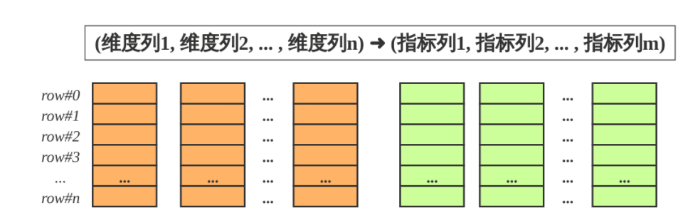
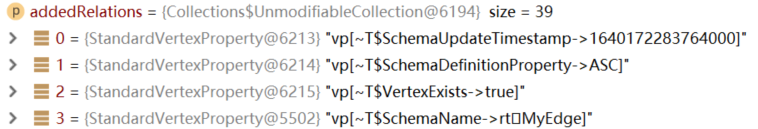
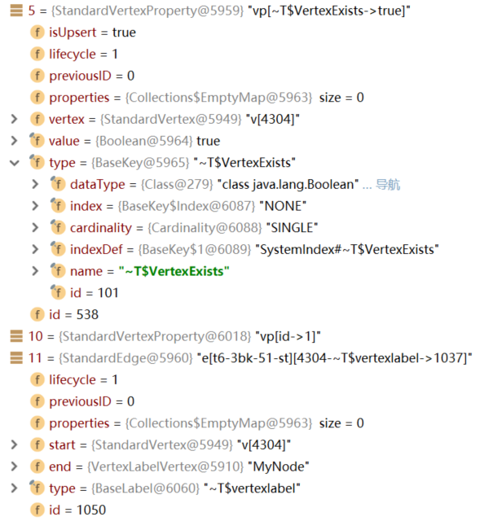
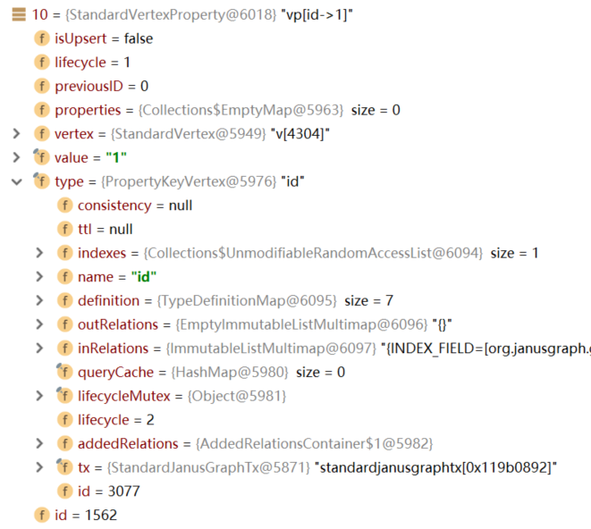
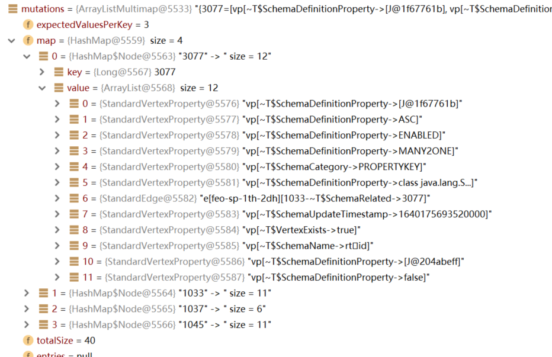
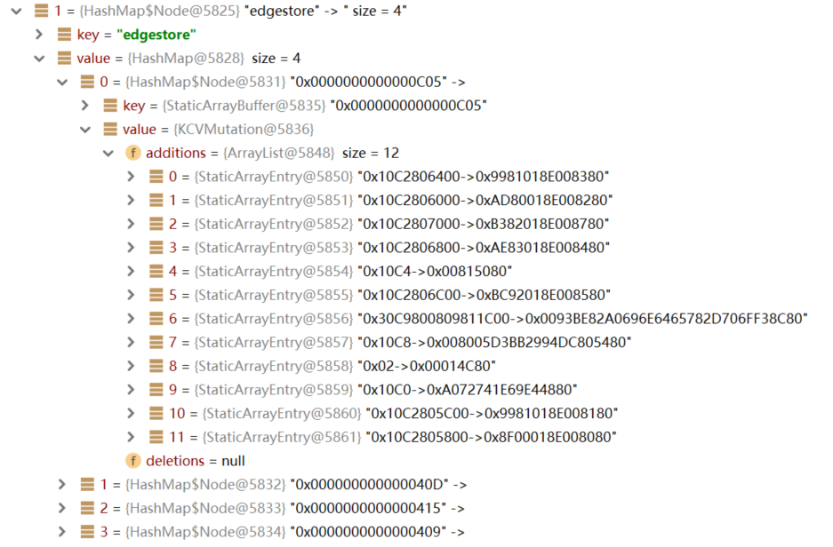
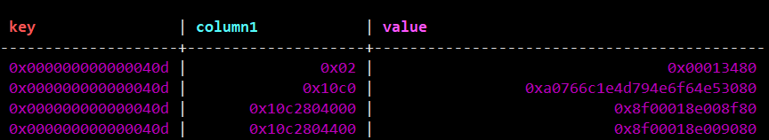
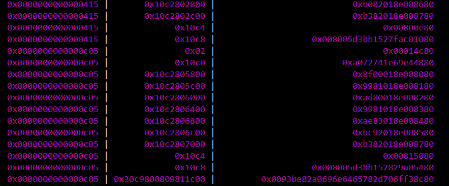

## starrocks

一张表的列可以分为维度列(也成为key列)和指标列(value列), 维度列用于分组和排序, 指标列可通过聚合函数

StarRocks的表也可以认为是多维的key到多维指标的映射。



在StarRocks中, 表中数据按列存储。


## janusgraph参考

### 1. schema

#### 1）EdgeLabel

```java
mgmt.makeEdgeLabel("MyEdge").make();
1. 创建一个schemaVertex
    schemaVertex = new EdgeLabelVertex(tx, 临时id, ElementLifeCycle.New)
2. 像vertex中添加属性
    addProperty(schemaVertex, BaseKey.SchemaName, schemaCategory.getSchemaName(name));
	   - StandardVertexProperty prop = new StandardVertexProperty
           (propId, key, (InternalVertex) vertex, normalizedValue, ElementLifeCycle.New);
			prop: vp[~T$SchemaName->rtMyEdge]
	   - connectRelation(prop);
			【判断：如果prop是属性，只在节点中加入这个关系；如果prop是边，在两边都加入】
			将prop添加到vertex节点的addedRelations集合中
       		addedRelations.add(prop);
```

#### 2）VertexLabel

```java
mgmt.makeVertexLabel("MyNode").make();
1. 创建一个schemaVertex
    schemaVertex = new VertexLabelVertex(tx, 临时id, ElementLifeCycle.New)
2. 和EdgeLabel一样
```

#### 3）PropertyKey

```java
PropertyKey id_key = mgmt.makePropertyKey("id").dataType(String.class).make();
1. 创建一个schemaVertex
    schemaVertex = new PropertyKeyVertex(tx, 临时id, ElementLifeCycle.New)
2. 和EdgeLabel一样
```

#### 4）Commit

> 详见[5. 存储查询汇总.md](D:\研究生\科研\项目\数仓-图数据库\图数据库\JanusGraph)

addedRelations：

 

最终得到mutations中的关系：

【vertexID, 【该vertex下的所有relation（属性+边）】】

 

具体：

   

#### 5）总结

序列化前：



序列化后：



edgestore表中：

- key：vertex ID
- column：属性的key
- value：属性的val

 

 


