## JanusGraph

> [官网文档](https://docs.janusgraph.org/)


## 官方文档

> [参考文档](http://imbajin.com/2018-06-24-JanusGraph%E7%9A%84%E5%AE%98%E6%96%B9%E6%96%87%E6%A1%A3%E7%BF%BB%E8%AF%91%E6%95%B4%E7%90%86V1.0/)

### 基本点

#### 配置

- 要启动一个Janus图实例，必须要提供一个configuration文件。
- 如果需要高级功能（e.g 全文索引, 地理查询, 范围查询），就需要一个单独的索引，如ES/Lucene

一个基于Cassandra+ElasticSearch的配置例子：

```
storage.backend=cql
storage.hostname=localhost
index.search.backend=elasticsearch
index.search.hostname=100.100.101.1, 100.100.101.2
index.search.elasticsearch.client-only=true
```

#### 数据模型 schema

- 顶点

  - vertex label描述的是vertex 的语义，不过vertex label是optional的，用来区分不同类型的vertex ，比如 `user` 和 `product`
  - 利用 `makeVertexLabel(String).make()` 来创建vertex label
  - vertex label必须保持全局唯一性

  创建vertex label实例：

  ```groovy
  mgmt = graph.openManagement()
  person = mgmt.makeVertexLabel('person').make()
  mgmt.commit()
  // Create a labeled vertex
  person = graph.addVertex(label, 'person')
  // Create an unlabeled vertex
  v = graph.addVertex()
  graph.tx().commit()
  ```

- 边

  在一个事务中，用`makeEdgeLabel(String)`来定义一个edge label，注意，edge label必须是唯一的，这个方法会返回一个`builder`，这个 `builder`可以用来获取这种`edge label`的多度关系 .而`multiplicity`，这个指标限定了每对（pair）之间edge最大的数量

  ```groovy
  mgmt = graph.openManagement()
  follow = mgmt.makeEdgeLabel('follow').multiplicity(MULTI).make()
  mother = mgmt.makeEdgeLabel('mother').multiplicity(MANY2ONE).make()
  mgmt.commit()
  ```

- 属性

  属性Property定义在顶点和边上，当然也可以用来定义其他东西，**property是 key-value 对的形式**。

  关注两点：

  - Property Key Data Type

  - Property Key Cardinality

    - SINGLE：每一个元素对于这个key只能有一个value，比如 `birthDate` 就是一个single基底，因为每个人最多只能有一个生日。
    - LIST：每个元素对于这个key可以有任意数量的值，比如我们建模传感器（sensor），其有一个属性是 `sensorRecords`，那么，对于这个属性，可能有一系列的值。注意，LIST是允许有重复元素的。
    - SET: 与LIST相同，不同的是，SET不允许有重复的元素。

    默认的cardinality是single。**注意，对于边属性来说，property key的基底始终是single**。

  ```groovy
  mgmt = graph.openManagement()
  birthDate = mgmt.makePropertyKey('birthDate').dataType(Long.class).cardinality(Cardinality.SINGLE).make()
  name = mgmt.makePropertyKey('name').dataType(String.class).cardinality(Cardinality.SET).make()
  sensorReading = mgmt.makePropertyKey('sensorReading').dataType(Double.class).cardinality(Cardinality.LIST).make()
  mgmt.commit()
  ```


**Relation types**:

Edge label和property key共同地被称为**relation type**。

可以通过 `containsRelationType()` 方法来检测relation type是否存在。

```groovy
mgmt = graph.openManagement()
if (mgmt.containsRelationType('name'))
    name = mgmt.getPropertyKey('name')
mgmt.getRelationTypes(EdgeLabel.class)
mgmt.commit()
```

#### Gremlin查询语言

Gremlin是JanusGraph默认的查询语言, Gremlin用来从JanusGraph里面查询数据，修改数据，Gremlin是一种**traversal**查询语言，可以很方便地查询此类查询：

“从小明开始，遍历到他的父亲，再从他的父亲遍历到他父亲的父亲，然后返回他父亲的父亲的名字”

Gremlin是Apache TinkerPop项目的一部分，是很重要的一部分

#### JanusGraph Server

JanusGrpah Server其实就是`gremlin server`

两种启动模式：分别是`webSocket`和`HTTP`

1. 使用官方打好的包（pre-package）

   相当于连接内置的

   `./bin/janusgraph.sh start` 就可以启动了，会自动fork cassandra的包，elasticsearch的包，gremlin-server的包，并连接到对应的服务器

   ```groovy
   $ bin/janusgraph.sh start
   Forking Cassandra...
   Running `nodetool statusthrift`.. OK (returned exit status 0 and printed string "running").
   Forking Elasticsearch...
   Connecting to Elasticsearch (127.0.0.1:9300)... OK (connected to 127.0.0.1:9300).
   Forking Gremlin-Server...
   Connecting to Gremlin-Server (127.0.0.1:8182)... OK (connected to 127.0.0.1:8182).
   Run gremlin.sh to connect.
   ```

2. 连接自己的

   给出了一系列的配置方法


后面是 工厂、事务、存储、索引以及一些高级用法


## 数据模型

> [参考文献](https://zhuanlan.zhihu.com/p/80866491)

janusgraph数据模型：

- GraphElement
- GraphSchemaElement

### GraphElement

在JanusGraph中，所有与图数据相关的元素都可以划分为两大类：点 + 关系

- GraphRelation

  - Edge（边）

  - VertexProperty（属性）

    相当于将一个点连接到一个属性值上，所以属性也是关系

    因为边在JG中也是一种特殊的点，所以没有EdgeProperty

- GraphVertex

用户的数据存储在边(`StandardEdge`)、 属性(`StandardVertexProperty`)与点(`StandardVertex`)里。

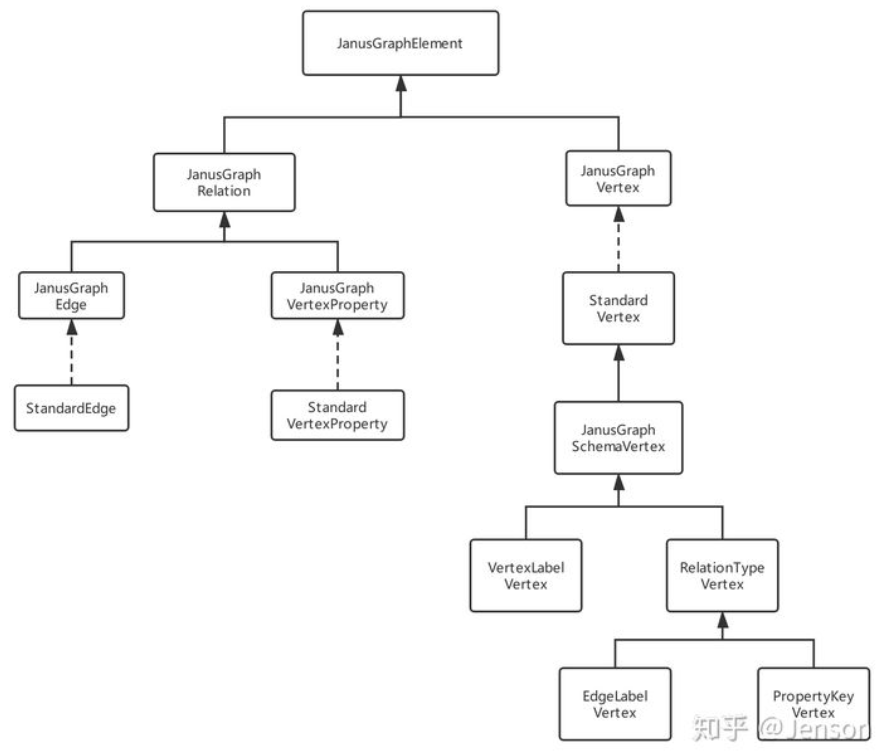

### GraphSchemaElement

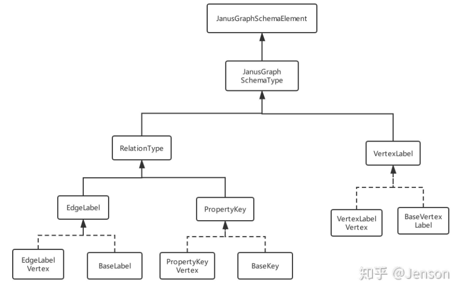

三个接口：

- EageLabel：边标签
  - 基本的label功能
  - 方向性：JanusGraph采用的是”按边切割（Edge-Cut）“的实现方式
    - 有向边：JanusGraph会在这条边的两端顶点都保存这条边的信息，因此两端顶点都会知道这条边的存在，从任意一个端点都能遍历到这条边
    - 单向边：JanusGraph只会在”起点(out-going vertex)“这一端保存这条边的信息，这样只有一个顶点知道这条边的存在，如果要遍历到这条边也只能从”起点“出发
  - 多重性(Multiplicity)：用于限制点和点之间，同一个标签的边可以有多少条。

- VertexLabel: 点标签

- PropertyKey：

  JanusGraph里面，点的属性(VertexProperty)的实现不是简单的Key-Value的形式。JanusGraph把属性的Key抽象成了PropertyKey，然后把属性的数据类型（Data Type）、Cardinality等特性定义在了PropertyKey里。

  一个属性`StandardVertexProperty`的实现类似：

  ```groovy
  public class StandardVertexProperty {
      protected final PropertyKey key;    // Property的Key
      private final Object value;         // Property的Value
  }
  ```

实现：

- EdgeLabelVertex
- VertexLabelVertex
- PropertyKeyVertex

注意，这三个实现类还继承了`JanusGraphSchemaVertex`类：表示边标签、点标签、属性key的底层实现都是一个点。这是**JanusGraph的Schema设计重点**

在图里面，Schema本来是用来描述、修饰点的；如果schema本身的实现也是一个点的话，那么schema自身的特性也可以用schema来定义。例如 `EdgeLabel`作为一种schema，本身具有一些特性（例如方向性、多重性），如果要改变这个EdgeLabel，例如添加一些成员，那就需要修改它的类；如果`EdgeLabel`本身也是一个Vertex，那么就可以像给点增加新的属性、新的边一样，给`EdgeLabel`这个schema动态增加新的特性。这样可以更灵活。

为了避免递归调用schema来描述schema，JanusGraph提供的“递归终止条件”是`BaseLabel`，`BaseKey`和`BaseVertexLabel`。

- 最基本的schema成员，无需再由其它schema来修饰、定义

- 预定义了一些固定的schema成员：

  `BaseKey`预置两个PropertyKey 用于修饰`PropertyKeyVertex`, `EdgeLabelVertex`以及`VertexLabelVertex`。：

  - SchemaName
  - SchemaCategory

### 示例

**1. 创建一个PropertyKey：**

```java
management.makePropertyKey("ID").dataType(Long.class).make();
```

运行结果：得到如下所示的一个`PropertyKeyVertex` 

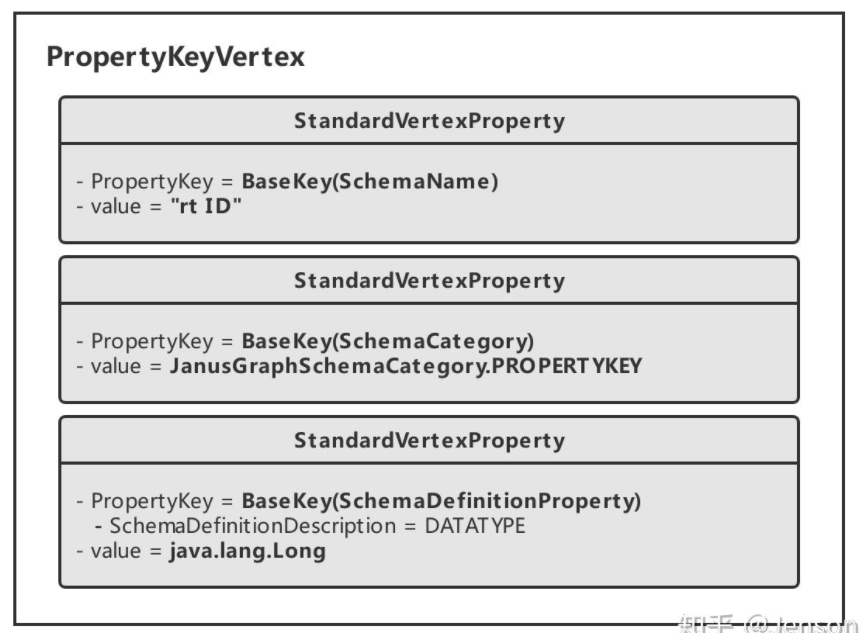 

>  "rt"是"Relation Type"的缩写
>
> JanusGraph给我们设置的值添加了前缀"rt": 方便区分当前schema的类型

**2. 创建一个VertexLabel：**

```java
management.makeVertexLabel("Student").make();
```

得到如下所示的一个`VertexLabelVertex` :

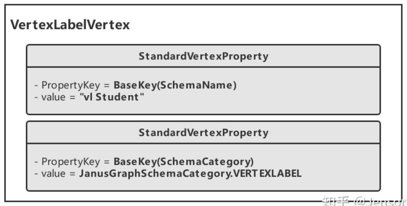 

> "vl"，是"Vertex Label"的缩写

**3. 创建一个Vertex：**

```java
g.addV("Student").property("ID", 11L).next();
```

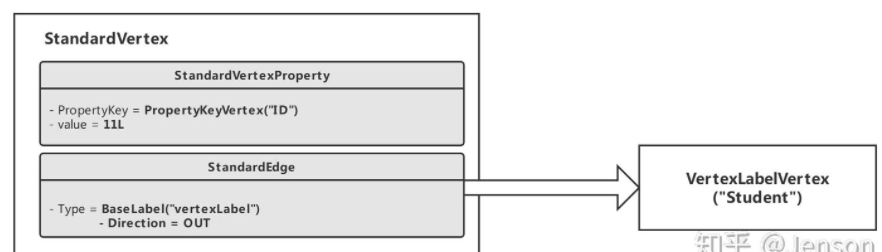 

相当于将点标签与属性解耦合

### 数据模型的底层映射存储

图是通过邻接表的格式存储的：

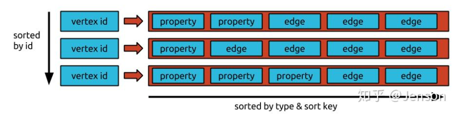 

以HBASE为例：

**元素ID：**

在JanusGraph里面，所有的元素（Element）都有ID。所以JanusGraph在将点、边等数据存储到HBASE时，也会大量使用到点、边、属性等的ID。下面列出了我们在创建PropertyKey、VertexLabel、Vertex时所生成的元素以及其对应的ID：

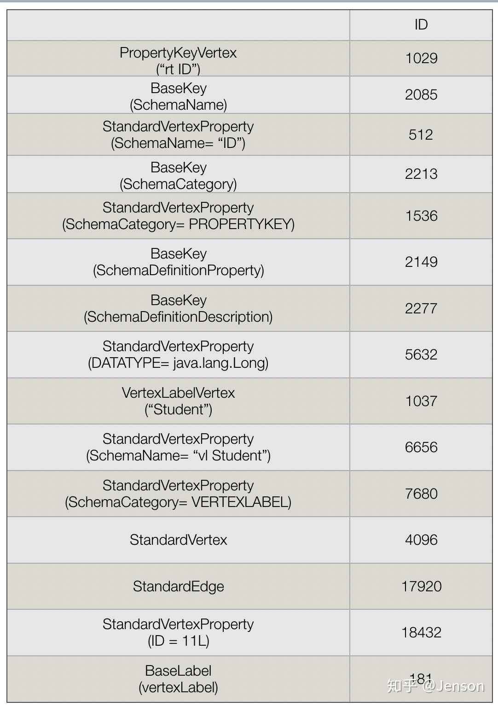  

PropertyKey映射到HBASE：

- JanusGraph在将点存储到HBASE时，会使用"e" （全称是"edgestore"）作为ColumnFamily。


VertexLabel映射到HBASE：


Vertex映射到HBASE：


### 总结

在JanusGraph里面，图的schema元素(VertexLabel，PropertyKey和EdgeLabel)实际上都是作为点来实现以及存储的。在存储用户创建的点(StandardVertex)时，点只保存了这些schema元素的ID。也因为如此实现，读取点时，在在获取了这些schema ID之后，还需要再通过ID来获取对应的schema元素。

- 优点：点的schema的实现可以更灵活，修改schema时也可以更高效。
- 缺点：如果图的schema元素非常多，内存缓存不下的时候，每次查询顶点时都会产生额外的IO查询点对应的schema元素，对性能损耗较大。


## 数据导入

> [参考文献](https://www.codenong.com/s1190000038517342/)

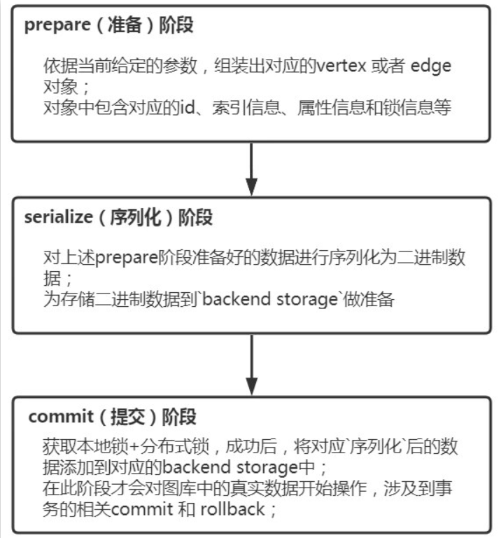 

[源码流程图](https://www.processon.com/view/link/5f471b2e7d9c086b9903b629)


## 补充

### 按边切割

张三用户节点通过手机号关联出来李四用户节点

- 张三 和 李四 代表Vertex；指向的name、age、gender代表张三的属性
- edgeA 和edgeB 代表Edge；也可以包含边的属性，例如下图中边包含属性create_time

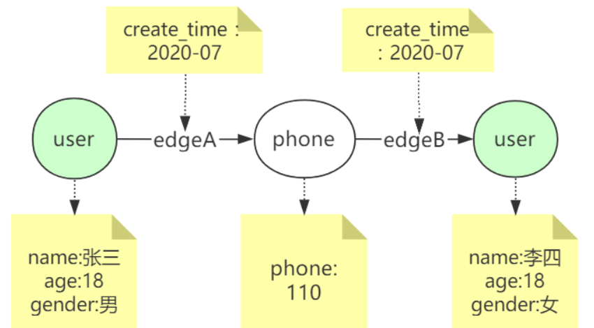 

按边切割：
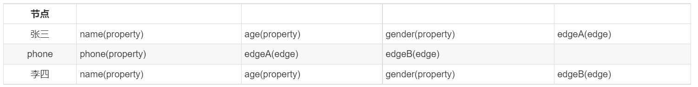

### HBase数据模型

> [参考文献](https://www.jianshu.com/p/5ce9b72e3341)

HBase中存储的数据，`表`组织结构如图所示：

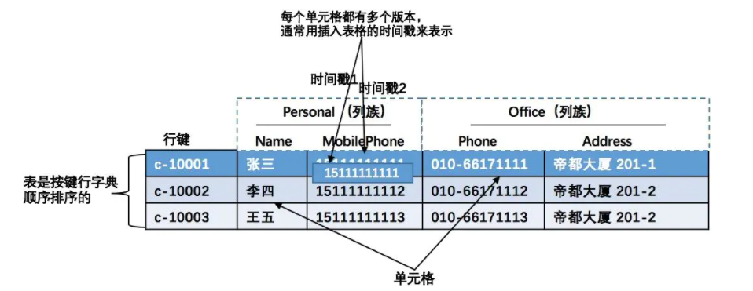

理解表结构：

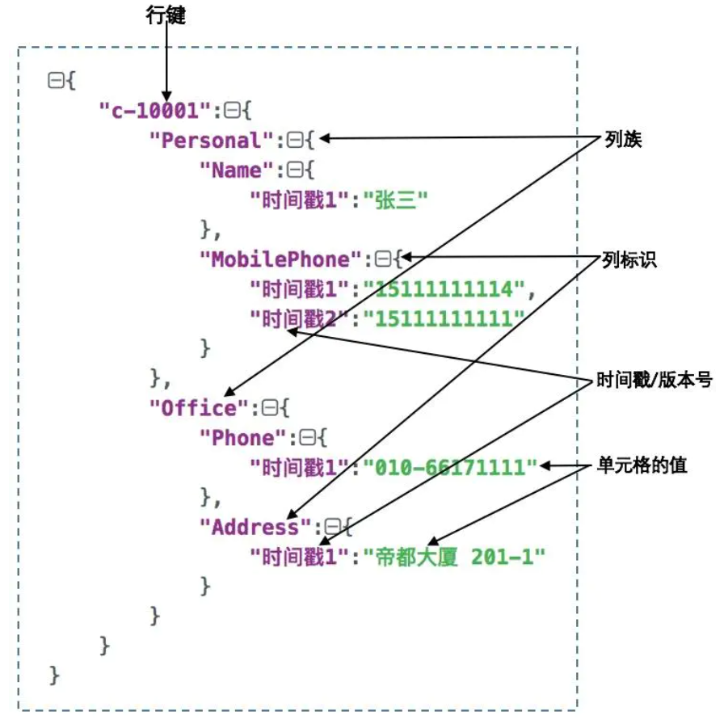 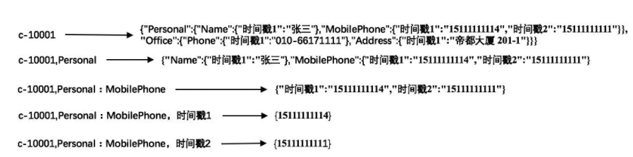

### vertex id结构

> [参考文献](https://blog.51cto.com/u_15162069/2913240)

Janusgraph在生成所有的id时统一的格式：

[ 0 | count | partition | ID padding (if any) ]

这个id是使用gremlin查询出节点时，节点上标识的vertex id； 

这个id值的顺序不同于hbase真实存储Rowkey的顺序。在对vertex id进行序列化存储时，位置有所调整为：

[ partition | 0 | count | ID padding (if any) ] 

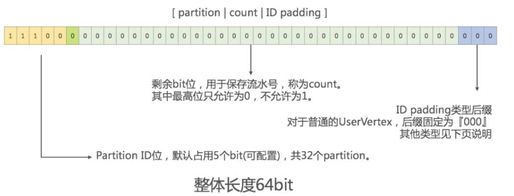

- partition是JanusGraph抽象出的一个概念。当Storage Backend是HBase时，JanusGraph会根据partition数量，自动计算并配置各个HBase Region的split key，从而将各个partition均匀映射到HBase的多个Region中。然后通过均匀分配partition id最终实现数据均匀打散到Storage Backend的多台机器中

  > hbase根据rowkey顺序排序存储; 使用vertex id作为rowkey, 在存储数据到hbase时，对rowkey进行排序，因为partition id在前5位，所以同一个分区的vertex id对应的rowkey值相差较小，所以会存储在一块

- 中间的count部分是流水号，其中最高位比特固定为0；出去最高位默认的0，count的最大值为2的(64-5-1-3)=55次幂大小：3 6028 7970 1896 3968，总共可以生成30000兆个id，完全满足节点的生成

- 最后几个bit是ID padding, 表示Vertex的类型。具体的位数长度根据不同的Vertex类型而不同。

  最常用的普通Vertex，值为'000'

  > ID padding放在最后可以便于快速查询到不同类型的节点（最前面是partition id，便于查找就只能放在最后了）

问题：为什么查询出的节点显示的vertex id要把0|count放在最前面、partiton和id padding放在后面呢？

- count占用55位数据，如果把count不放在最前面，那么id的最小值比2的55次幂还大，显示不友好
- 把0|count放在最前面：
  - 0在有符号表示中标识当前id始终为正整数
  - count是趋势递增的，所以id值也是从小到大趋势递增的，节点id的最小值在2的8次幂周边大小； 比把count放在后面显示的id值友好

