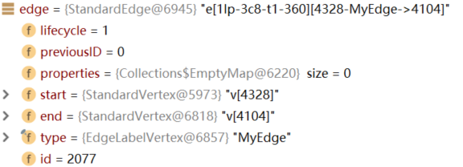
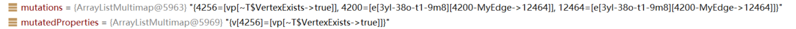
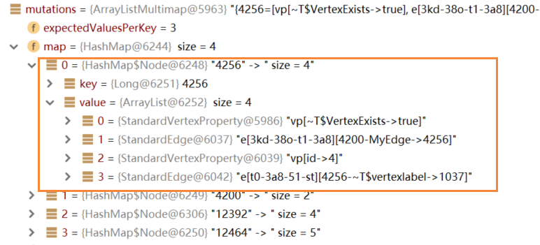

## 存储

对于边 1-2 的存储

代码：

```java
//首先创建必须的schema
ManagementSystem mgmt = (ManagementSystem) JanusG.openManagement();
mgmt.makeEdgeLabel("MyEdge").make();
mgmt.makeVertexLabel("MyNode").make();
PropertyKey id_key = mgmt.makePropertyKey("id").dataType(String.class).make();
mgmt.commit();

//连边存储操作
srcVertex = JanusG.addVertex("MyNode");
srcVertex.property("id", srcId);

dstVertex = JanusG.addVertex("MyNode");
dstVertex.property("id", dstId);

srcVertex.addEdge("MyEdge", dstVertex);

JanusG.tx().commit();
```

> Janusgraph存储一定要有schema，对于addEdge来说，必须传入前面的EdgelableName才可以
>
> 如果没有自定义schema，Janusgraph需要开启允许默认schema的操作，但是强烈建议自定义

### 1. add部分

1. 判断传入的vertexLabel是否是已创建的schema（是否在数据库中存储），如果是，返回已有的VertexLabel；否则重新创建。

   - 判断是否有VertexLabel

     1）获取数据库schemaID，若获取失败，表示没有该schema

     ​		"MyNode" -> "vl MyNode"（1037）

     2）根据schemaID+LifeCycle构建获取的VertexLabelVertex

2. addVertex (VertexLabel)

   - 通过临时id+ElementLifeCycle.New创建一个新的vertex

   - 分配id

   - 添加默认属性

     ```java
     addProperty(vertex, BaseKey.VertexExists, Boolean.TRUE);
     	StandardVertexProperty prop
             [(propId, key,vertex, normalizedValue, ElementLifeCycle.New)]
               属性ID，要添加KV属性的vertex，[k, v], LifeCycle
         graph.assignID(prop);
         connectRelation(prop);
     		addedRelations.add(r);
     ```

   - 和VertexLabel点连边

     ```java
     addEdge(vertex, label, BaseLabel.VertexLabelEdge);
     addEdge(JanusGraphVertex outVertex, JanusGraphVertex inVertex, EdgeLabel label)
              v[4328]  MyNode  ~T$vertexlabel
          StandardEdge edge
         	[(edgeId, label, outVertex, inVertex, ElementLifeCycle.New)]
          graph.assignID(edge)
          connectRelation(edge);
             inVertex添加这条边（因为是点到属性的边，所以只在点这一边add）
     		addedRelations.add(edge);
     	 
     ```

   - 将该节点加入缓存

3. srcVertex.property("id", srcId)

   ```java
   tx().addProperty(vCardinality, it(), propertyKey, value);
   ```

4. srcVertex.addEdge("MyEdge", dstVertex)

   调用事务中的方法：

   addEdge(Long id, JanusGraphVertex outVertex, JanusGraphVertex inVertex, EdgeLabel label)

   ​					null			srcVertex                                 dstVertex                                 "MyEdge"

   ```java
   StandardEdge edge
   graph.assignID(edge)
   connectRelation(edge)
       connectRelation(InternalRelation r)
       - 判断是单向边还是双向边 r.getVertex(i).addRelation(r)
         点->属性：单向边OUT，只在点的addedRelations中添加关系
         点->点：双向边BOTH，在两个点的addedRelations中都要添加关系
         addRelation [StandardVertex]：
       	 addedRelations.add(r)
       	 updateLifeCycle(ElementLifeCycle.Event.ADDED_RELATION);
       addedRelations.add(r);//事务中的addedRelations
   return edge
   ```
    

### 2. commit部分

1. 添加addedRelations

   所有关系存储在mutations.put(vertex.longId(), add);

   - 如果当前是属性：添加到mutatedProperties中 mutatedProperties.put(vertex,add)
   - 如果当前是双向边（点->点），关系在两个点分别存一次

   > 示例：对于两个关系，添加情况如下
   >
   > 

2. 将mutations中存储的关系序列化，转换成能存储到数据库中的数据

  mutations中的关系：【vertexID, 【该vertex下的所有relation（属性+边）】】

  > 

  对于每个vertexID，依次处理其关系：

  1. 将关系序列化，得到entry，添加到vertex下的additions中：

     ```java
     StaticArrayEntry entry = edgeSerializer.writeRelation(edge, type, pos, tx);
     									pos表示入边还是出边（0：出边 1：入边）
     additions.add(entry);
     ```

     序列化过程见第三部分

  2. 对vertexID序列化

     ```java
     StaticBuffer vertexKey = idManager.getKey(vertexId);
     ```

  3. mutator.mutateEdges(vertexKey, additions, deletions)

     调用edgeStore.mutateEntries(key, additions, deletions, storeTx);

     storeMutation：【序列化后的vertexId，【序列化后的additions】】

     ```java
     KCVEntryMutation m = new KCVEntryMutation(additions, deletions);
     Map<StaticBuffer, KCVEntryMutation> storeMutation
     ```
     如果开启了批处理，只有在达到批处理个数条件时才会flushInternal()刷新，将storeMutation中内容存入数据库
  
3. 将未提交的内容提交

   mutator.commitStorage(); --> 依然调用flushInternal()

   


### 3. 序列化

1. DataOutput out: 128位byte

2. IDHandler.writeRelationType(out, typeId, dirID, type.isInvisibleType());
   序列化edgetype：【Invisible &amp; System (2 bit) | Relation-Type-ID (1 bit) | Relation-Type-Count (variable) | Direction-ID (1 bit)】

3. 对relation序列化：

   **edge：**

   示例：e\[3kd-38o-t1-3a8][4200-MyEdge->4256]，vertexID=4256

   - otherVertexId = 4200
   - VariableLong.writePositiveBackward(out, otherVertexId)
   - VariableLong.writePositiveBackward(out, relationId)
   - 把上面的edge的vertexID也都序列化进去，得到entry